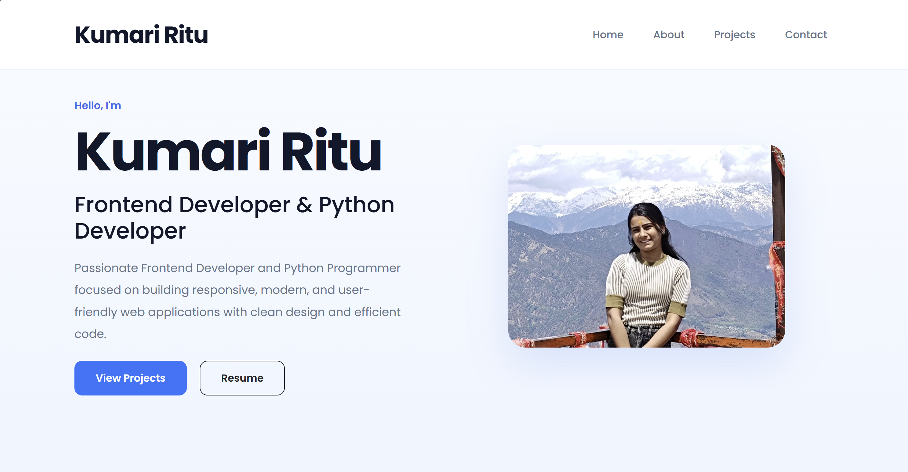

# 💼 Personal Portfolio Website

A modern and fully responsive **Personal Portfolio Website** built using **HTML5, CSS3, Bootstrap, and JavaScript**. This project showcases my skills, projects, education, and contact information through a clean, professional, and interactive user interface designed to provide an engaging user experience across all devices.

<p align="center">
  
</p>

---

## 🚀 Live Demo

🌐 **Live Website:** https://personal-portfolio-one-sable-78.vercel.app/

💻 **GitHub Repository:** https://github.com/KumariRitu21/Personal_Portfolio

---

## ✨ Features

- 👋 Modern Hero Section with Introduction
- 🎨 Clean & Professional User Interface
- 📱 Fully Responsive Design (Desktop, Tablet & Mobile)
- 👨‍💻 About Me Section
- 🛠️ Skills Showcase
- 📂 Featured Projects Gallery
- 📄 Resume Download Button
- 📧 Contact Section
- 🖱️ Smooth Scrolling Navigation
- ✨ Interactive Hover Animations
- ⚡ Fast and Lightweight Performance

---

## 🛠️ Tech Stack

| Technology | Usage |
|------------|---------------------------|
| HTML5 | Page Structure |
| CSS3 | Styling & Layout |
| Bootstrap | Responsive Components |
| JavaScript | Interactivity |
| Font Awesome | Icons |
| Responsive CSS | Mobile-Friendly Design |

---

## 📂 Project Structure

```
portfolio/

│── index.html
│── script.js

├── css/
│   ├── style.css
│   └── responsive.css

├── images/
│   ├── profile.jpg
│   ├── hero-image.png
│   ├── project1.png
│   ├── project2.png
│   ├── project3.png
│   ├── project4.png
│   ├── skills.png
│   └── preview.png

├── assets/
│   └── resume.pdf

└── README.md
```

---

## 📸 Project Highlights

✔ Modern Hero Section

✔ Responsive Navigation Bar

✔ About Me Section

✔ Skills Showcase

✔ Featured Projects Gallery

✔ Resume Download Option

✔ Contact Form

✔ Responsive Footer

✔ Optimized for Desktop, Tablet & Mobile

---

## 🎯 Learning Outcomes

This project helped strengthen my understanding of:

- Responsive Web Design
- HTML5 Semantic Elements
- CSS Flexbox & Grid
- Bootstrap Components
- JavaScript DOM Manipulation
- UI/UX Design Principles
- Frontend Project Structure
- Git & GitHub Workflow

---

## 🌟 Future Improvements

- Dark/Light Theme Toggle
- Project Filtering
- Blog Section
- Animation on Scroll
- Backend Contact Form Integration
- Multi-language Support
- Performance Optimization

---

## 👨‍💻 Developer

**Pargat Singh**

Frontend Developer | Engineering Student

- 🔗 GitHub: https://github.com/KumariRitu21
- 💼 LinkedIn: www.linkedin.com/in/kumari-ritu-8389983b2

---

## ⭐ Support

If you found this project helpful or inspiring, consider giving it a ⭐ on GitHub.

It motivates me to build and share more frontend projects.

---

<p align="center">
  Made with ❤️ by <b>Kumari Ritu</b>
</p>
